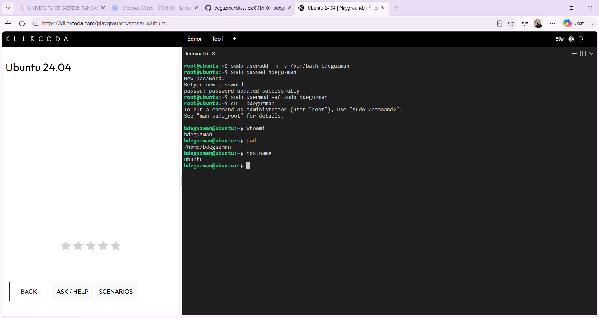
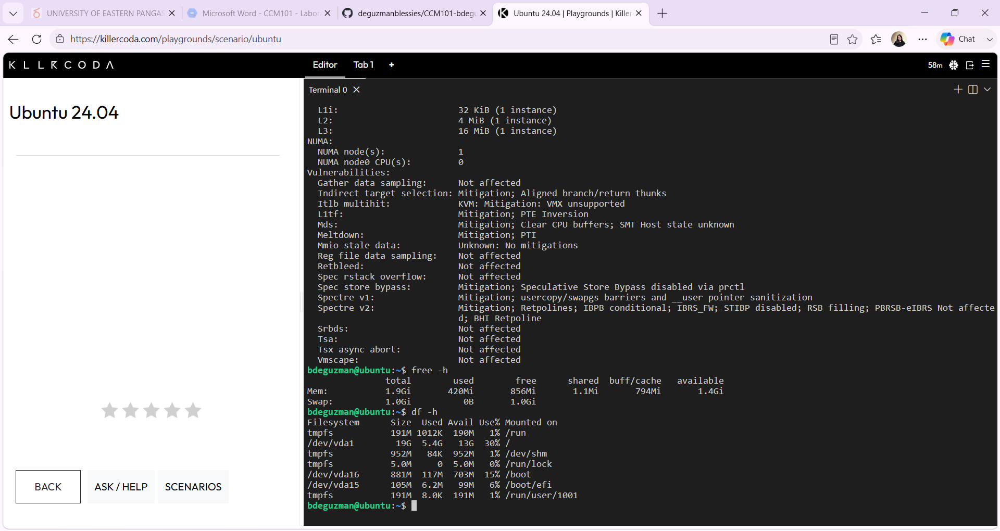
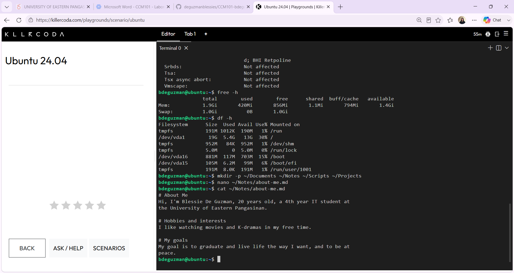
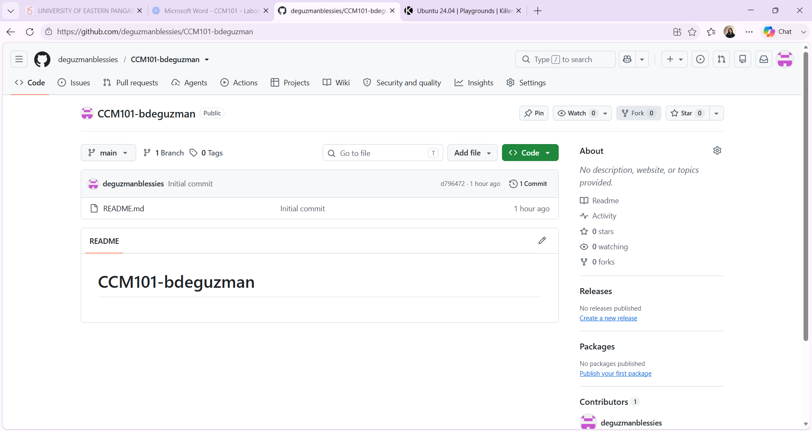
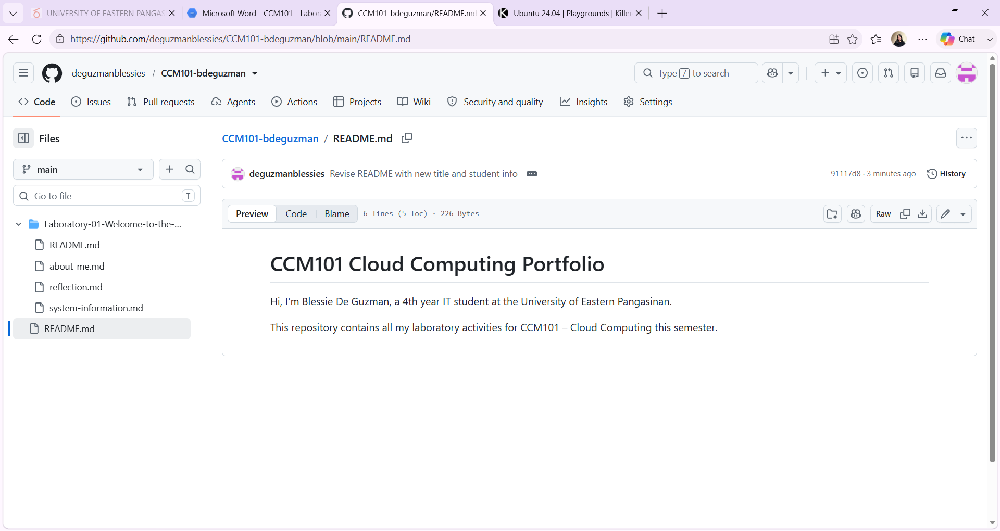

# Laboratory 1: Welcome to the Cloud

## Mission Overview
Set up a Linux environment on KillerCoda, explored the system, and built a
GitHub portfolio.

## Objectives
- Use a cloud-based Linux environment (KillerCoda)
- Navigate Linux and gather system information
- Organize files and directories
- Create a GitHub repository
- Document work using Markdown

## Activities Performed
1. Created a new sudo user and logged in
2. Checked distribution, kernel, CPU, memory, and disk space
3. Documented findings in system-information.md
4. Built a folder structure and created about-me.md
5. Created and organized the GitHub repository
6. Uploaded all files and screenshots

## Linux Commands Used
useradd, passwd, usermod, su, whoami, pwd, hostname, cat, uname, lscpu, free,
df, mkdir, nano

## Skills Learned
Basic Linux navigation, system inspection, file organization, Markdown
documentation, and using GitHub.

## Screenshots

