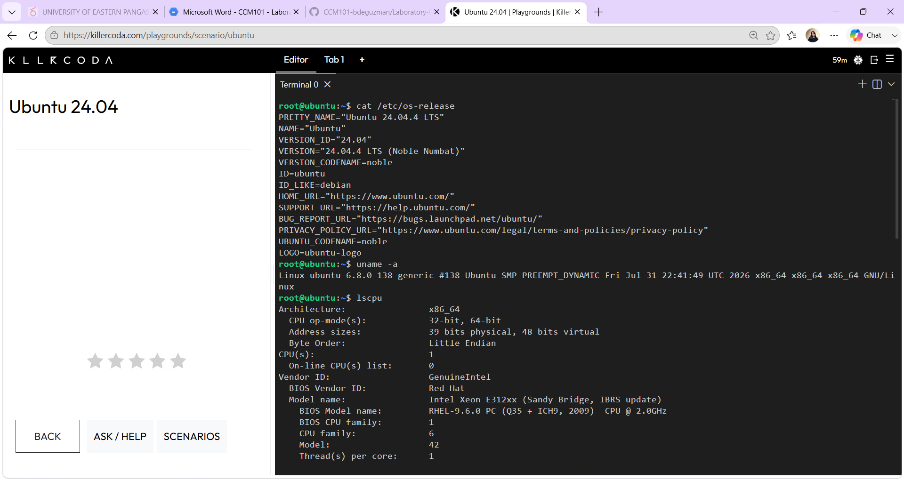

## Linux Server Investigation (Checkpoint 7)

**Operating System:** Ubuntu 20.04 LTS

**CPU Information:** 2 vCPUs

**Memory:** 4 GB RAM

**Disk Space:** 20 GB total

## Which Cloud Services Could Host This Server?

This Linux server could be hosted using AWS EC2, Azure Virtual Machines, or Google Compute Engine, since all three offer virtual machines that can run Ubuntu with similar specs. AWS EC2 would be a good fit because of its flexible instance sizing and wide range of options. Azure Virtual Machines would work well if the server needed to connect with other Microsoft-based systems. Google Compute Engine would be ideal if the server was going to be used for AI/ML workloads or containerized apps, since GCP has strong support in that area.
