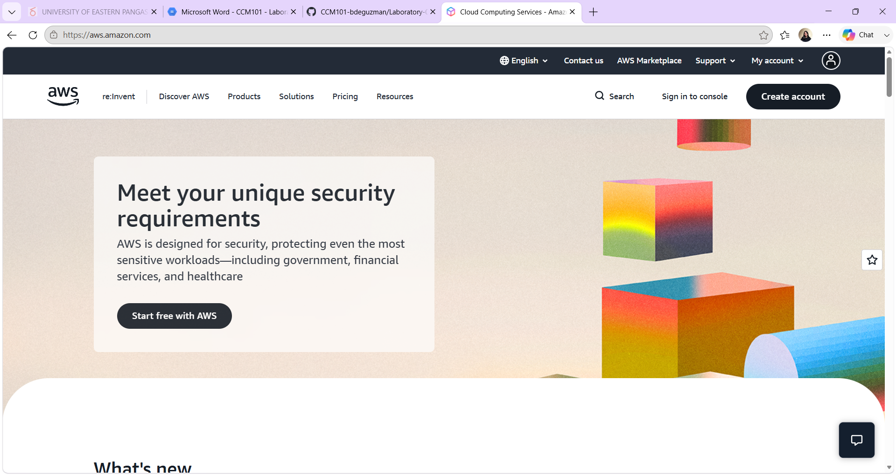

# Amazon Web Services (AWS) Research

## Brief Overview
AWS is the cloud computing platform launched by Amazon in 2006. It was the first major public cloud provider and remains the market leader, offering over 200 fully-featured services from data centers globally, covering compute, storage, databases, networking, AI/ML, analytics, and more.

## Global Infrastructure
- Regions: 30+ geographic regions worldwide
- Availability Zones: 90+ (typically 3+ per region)
- Edge locations: 600+ (via CloudFront CDN) for low-latency content delivery

## Cloud Management Console
The AWS Management Console is the web-based dashboard used to create, configure, and monitor AWS resources. It provides a search bar, service catalog, billing dashboard, and CloudShell terminal access.

## Four Core Services
1. **Amazon EC2 (Elastic Compute Cloud)** – Resizable virtual servers for running applications
2. **Amazon S3 (Simple Storage Service)** – Scalable object storage for files, backups, and static content
3. **Amazon RDS (Relational Database Service)** – Managed relational databases (MySQL, PostgreSQL, etc.)
4. **AWS Lambda** – Serverless compute that runs code in response to events without managing servers

## Three Advantages
1. Broadest and deepest service catalog of any provider, covering nearly every use case
2. Mature, large-scale global infrastructure with the most regions/availability zones
3. Strong ecosystem of third-party tools, partners, and community support/documentation

## Typical Enterprise Use Cases
- Large-scale web hosting and e-commerce platforms
- Big data analytics and data lakes
- Enterprise backup and disaster recovery
