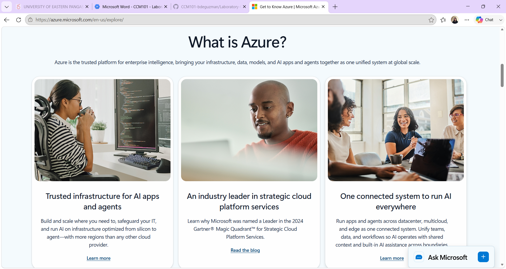

# Microsoft Azure Research

## Brief Overview
Azure is Microsoft's cloud platform, launched in 2010. It's especially strong for organizations already using Microsoft products (Windows Server, Active Directory, Microsoft 365), offering deep hybrid-cloud and enterprise integration alongside standard cloud services.

## Global Infrastructure
- Regions: 60+ regions worldwide (more than any other provider)
- Availability Zones: Available in most regions (typically 3 per region)
- Edge locations: 190+ via Azure CDN/Front Door

## Cloud Management Console
The Azure Portal is the web-based interface for creating and managing Azure resources, with a "Create a resource" marketplace, resource groups, and a unified billing/cost management dashboard.

## Four Core Services
1. **Azure Virtual Machines** – On-demand, scalable virtual servers
2. **Azure Blob Storage** – Object storage for unstructured data
3. **Azure SQL Database** – Managed relational database service
4. **Azure Active Directory (Microsoft Entra ID)** – Identity and access management, tightly integrated with Microsoft 365/on-prem AD

## Three Advantages
1. Best-in-class integration with Microsoft products (Windows Server, 365, Active Directory)
2. Strong hybrid cloud support (Azure Arc, Azure Stack) for on-prem + cloud environments
3. Widest number of global regions, useful for data residency/compliance requirements

## Typical Enterprise Use Cases
- Organizations migrating existing Windows/Microsoft infrastructure to the cloud
- Hybrid cloud deployments (mixing on-premises and cloud resources)
- Enterprise identity and directory services
