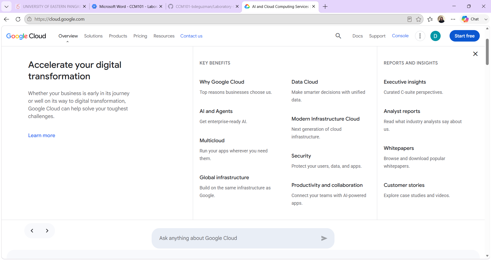

# Google Cloud Platform (GCP) Research

## Brief Overview
GCP is Google's cloud platform, launched in 2008 (public availability around 2011–2013 for most services). It leverages Google's own infrastructure (the same network powering Search and YouTube) and is widely recognized as a leader in data analytics, AI/ML, and Kubernetes/container orchestration.

## Global Infrastructure
- Regions: 40+ regions worldwide
- Availability Zones: 120+ (typically 3+ per region)
- Edge locations: 190+ points of presence via Google's global network/CDN

## Cloud Management Console
The Google Cloud Console is the web UI for managing GCP resources, featuring a navigation menu (☰) listing all services, a Cloud Shell terminal, and built-in cost/billing tools.

## Four Core Services
1. **Compute Engine** – Customizable virtual machines
2. **Cloud Storage** – Object storage for any amount of data
3. **Cloud SQL** – Managed relational database service
4. **Google Kubernetes Engine (GKE)** – Managed Kubernetes for container orchestration (widely considered the industry-leading K8s service, since Google created Kubernetes)

## Three Advantages
1. Strongest AI/ML tooling (Vertex AI, TPUs) built on Google's own AI research
2. Best-in-class Kubernetes/container support (GKE), since Google originated Kubernetes
3. Competitive pricing model with sustained-use discounts and strong data analytics tools (BigQuery)

## Typical Enterprise Use Cases
- AI/ML research and large-scale machine learning training
- Data analytics and big data processing (BigQuery)
- Container-based/Kubernetes-native application deployment
