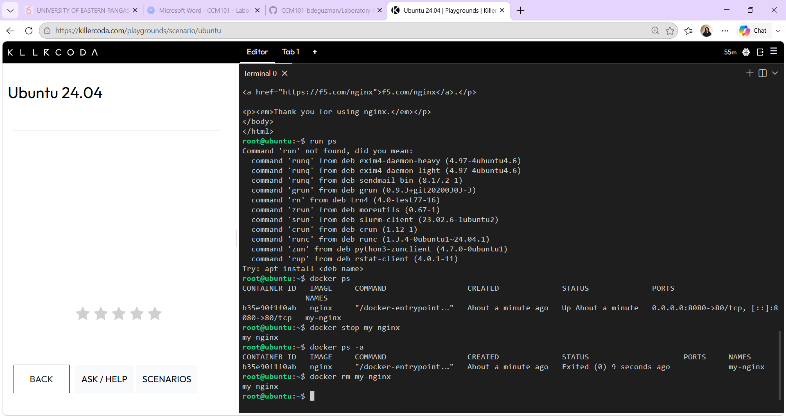

# Docker Deployment

- `docker ps` — Lists all running containers.
- `docker stop my-nginx` — Stops the running Nginx container.
- `docker ps -a` — Shows all containers to confirm it stopped.
- `docker rm my-nginx` — Deletes the container permanently.

