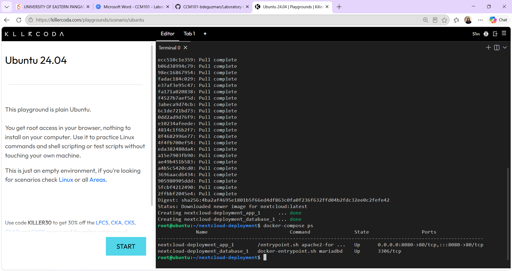
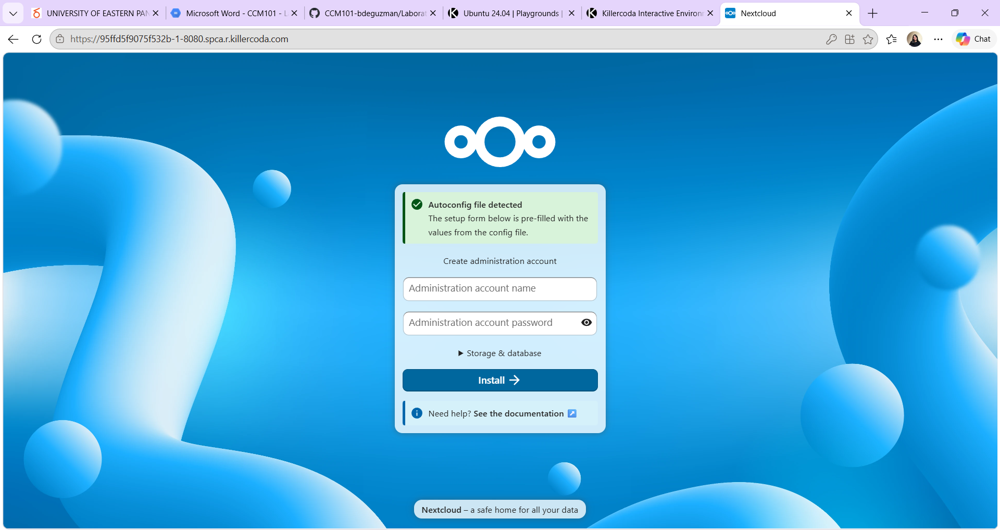
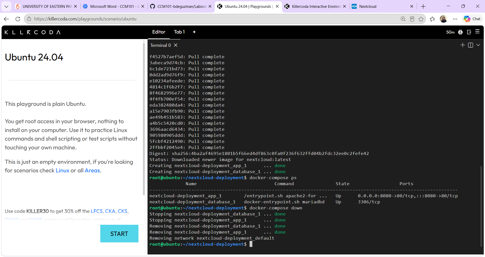

# Laboratory 6: The Cloud Deployment Engineer

## Mission Overview
Deployed a two-tier private cloud storage application (Nextcloud + MariaDB) using Docker Compose as Infrastructure as Code.

## Objectives
- Explain multi-tier architecture
- Understand the structure of docker-compose.yml
- Use a Linux command-line text editor (nano) to create configuration files
- Deploy a multi-container application with Docker Compose
- Document the work in Markdown

## Commands Executed
- `mkdir nextcloud-deployment`
- `cd nextcloud-deployment`
- `nano docker-compose.yml` (attempted; paste caused indentation errors)
- `printf '...' > docker-compose.yml` (used to create the file correctly)
- `cat docker-compose.yml`
- `docker-compose up -d`
- `docker-compose ps`
- `docker-compose down`

## Skills Learned
- Writing a docker-compose.yml file
- Troubleshooting YAML indentation errors
- Using the Linux terminal (nano, cat, printf)
- Deploying and tearing down multi-container applications
- Understanding two-tier architecture
- Documenting infrastructure in Markdown

## Screenshots

